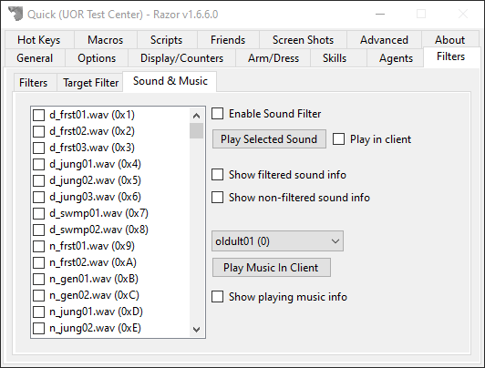
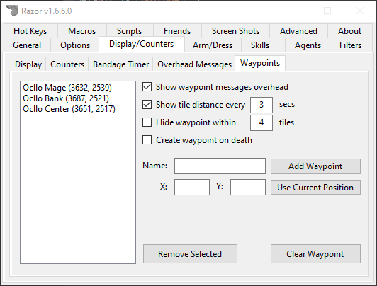

# General Settings

The General tab has setting largely related to the client itself and Razor in general.

## General

### Profiles

Each character has a profile that contains your settings, such as the options in Razor and your hotkeys. Profiles are stored in the same location as `Razor.exe` under `.\Profiles\`. You can create a new profile, which will be based on the *default profile settings*

* **New**
    * Create a new profile based off of the default Razor profile.
* **Save**
    * Save all the current Razor settings without having to log out.
* **Clone**
    * Clone the existing selected profile and create a new one.
* **Delete**
    * Delete the selected profile.

#### Creating a new profile

Clicking **New** will generate a new profile based on the default profile that comes with Razor. If you rather create a new profile using an existing profile, select that profile first and click the **Clone** button.

#### Saving your profiles

Razor will save your profile two ways.

* When you open your paperdoll in UO, click **Logout** and click **OK**. 
    * This triggers the client to tell Razor that you logged off, which performs the profile save.
* Click the **Save** button manually to ensure your changes are saved.

#### Backing up your profiles, macros and scripts

To create a backup, click the `Create Backup` button. This will copy all your profiles, macros and scripts to the `Backups` folder in the root of your Razor folder.

### In-Game Commands

Razor supports the following in-game commands (not case-sensitive).

!!! note "Command Prefix"
    The command prefix with the OSI client is `-`.

    If you are using ClassicUO, you must prefix each command with `>`.
    
    For example, instead of `-where` you would type `>where`. This is due to ClassicUO commands starting with `-` and several UO commands for yell, whisper, guild use other symbols so Razor had find something unique.

* `help` - Displays all the in-game commands you see here.
* `adduseonce` - Creates a target that adds the item to the **UseOnce** list.
* `time` - Displays the current client system time.
* `where` - Displays your X/Y/Z coordinates according to Razor.

!!! tip
    Some shards support `[where` to get your location from the server.

* `ping` - Pings the server 5 times and returns the results.
* `echo` - Send a message to yourself. Useful for leaving a note to yourself when macroing, for example.
* `getserial` - Get information on the RPV you are viewing to verify authenticity.
* `rpvinfo` - Get information on the RPV you are viewing to verify authenticity.
* `macro [name]` - This will run a macro in-game. If you have a macro called `CreateRobes` you would type `macro CreateRobes`.
* `hue` - Display information about an item, include the hue.
* `item` - Same as `hue`.
* `resync` - This will resync your client, the same way the resync hotkey does.
* `mobile` - Display some general information about a mobile (used for debugging)
* `weather [weather_type] [num_of_effects]` - Set the weather in the game. Weather will end automatically after 6 minutes, on newer clients it will end in 10 minutes.
    * `[weather_type]`:
        * `0` - It starts to rain
        * `1` - A fierce storm approaches
        * `2` - It begins to snow
        * `3` - A storm is brewing
    * `[num_of_effects]` - Max number on the screen (client restriction) is 70.
* `season [season_type]` - Sets the season. This is client side only.
    * `[season_type]`:
        * `0` - Spring
        * `1` - Summer
        * `2` - Fall
        * `3` - Winter
        * `4` - Desolation (Feluccia)
* `set [variable]` - Sets a macro variable
* `waypoint [x] [y]` or `track off` - Sets a waypoint at a specific `X/Y` location. If you pass `off` it will remove it from the client.

### Maps / Boat

#### UOPS

Razor's Ultima Online Position System (UOPS) gives you a basic map.

#### Boat Control

**Boat Control** was inspired by UO Rudder and designed to make navigating the seas of Britannia much easier. This tool is built into Razor.

!!! tip
    Right-clicking on 1 of the 4 directions will set relative location.

### Other

* Show Welcome Screen (Global Setting)
    - When checked, opening Razor will give you the **Welcome Screen**. This is where you can enter new servers, change your client location, etc.
* Use Smart Always on Top
    - Razor will stay on top of the UO window when it becomes active and hide when it becomes inactive.
* Show in Taskbar or System Tray
    - You can have Razor in the Taskbar or the System Tray. It's all up to you.
* Default Client Priority
    - This changes the priority given to the process. Honestly, leave it at **Normal**. This feature should be removed. It's old.
* Language
    - The `.\Language\` folder contains all the translations. Some are missing, feel free to translate based on the `.enu` file located in the package.
* Opacity
    - Adjust the transparency of Razor. Useful on a single monitor.

## Sound & Music

* Enable Sound Filter
    - When checked, sounds that are checked will be blocked from playing in the client.
* Play Selected Sound
    - Listen to the selected sound. If you check `Play in client` the sound will play in the client if logged in.
* Show filtered sound info
    - If a sound is blocked, show the name in system messages.
* Show non-filtered sound info
    - If a sound plays, show the name in system messages.
* Play Music In Client
    - Plays the specific song in the client if logged in.

## Waypoints

This feature lets you set waypoints, that will display within the client.

* **Show waypoint messages overhead**
    - Direct waypoint messages from system message to overhead.
* **Show tile distance every X**
    - If checked, it will show the current distance every X seconds.
* **Hide waypoint within**
    - When you're within X tiles, hide the waypoint.
* **Create waypoint on death**
    - Upon death, create a waypoint.
